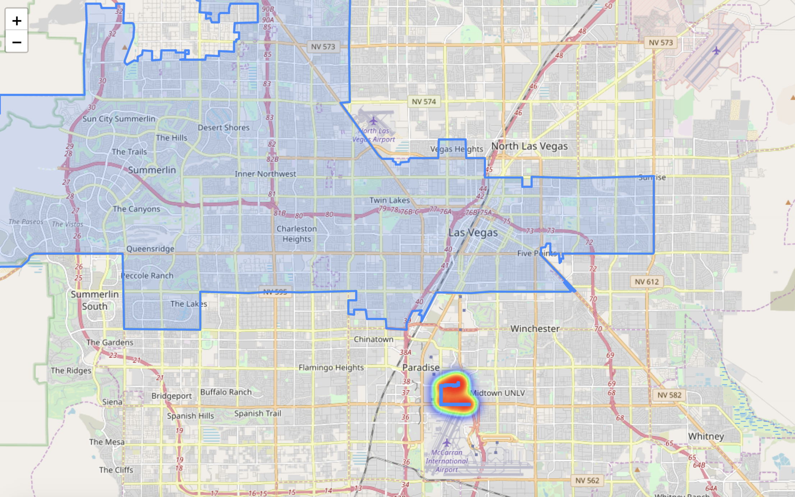

# YNDX self-driving log analyzer

A utility to parse and analyze a self-driving car log file.

## Usage

For basic usage please clone the repo and execute `runner.sh` 
providing an url leading to a log file.
```python
$ git clone https://github.com/maximkeremet/yndx_self_driving_log_analyzer.git
```

## Log file format requirements

Log file should be in text format and contain key-value lines, like: 

- `{"control_switch_on": binary state (1/0), "ts": unix timestamp}` 
- `{"geo": {"lat": latitute coordinates,"lon": longitude coordinates}, "ts": unix timestamp}`

## Results

The basic output of the scripts are located in `results` folder.
Util output a report in `csv` format with calculated distance in meters 
covered by a self-driving car and an html with 
plotted car route and city are (in our case, Las Vegas) 

A full log of the module can be helpful and can found in `monitoring` 
as a text file with corresponding date and unix ts.

**Distance report:**

| mode| distance, m | perc.|
| ----|-------------|------|
|human| 266.2465 | 9.35 |
|autopilot|2580.0803 | 90.65|

**Map:**


## Further development

- improve polygon parsing from Nominatim geocoder in order to 
support other locations properly
- improve logging format for bigger log files
- optimize overall performance

